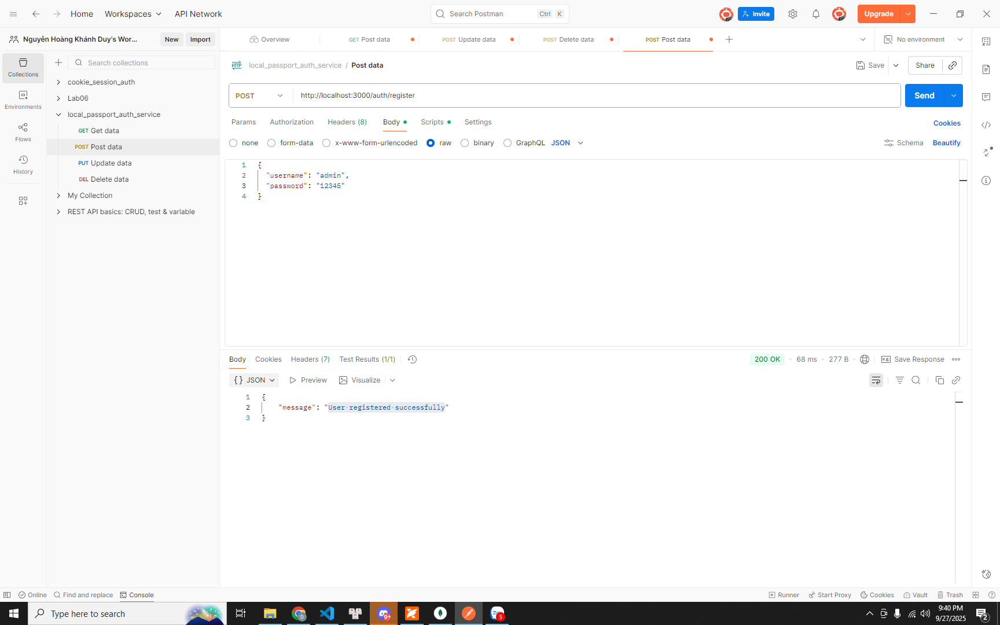
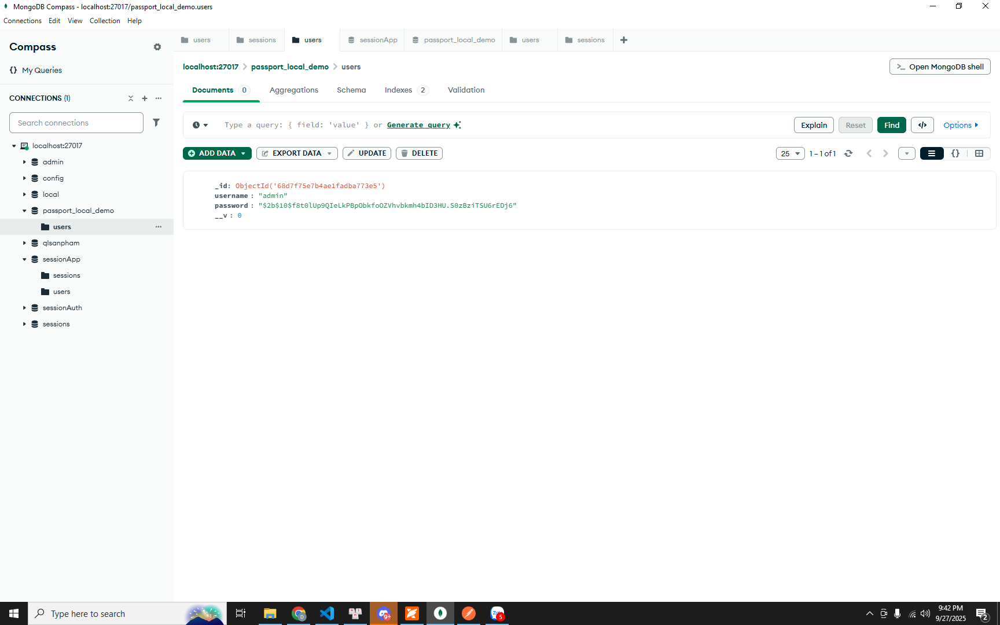
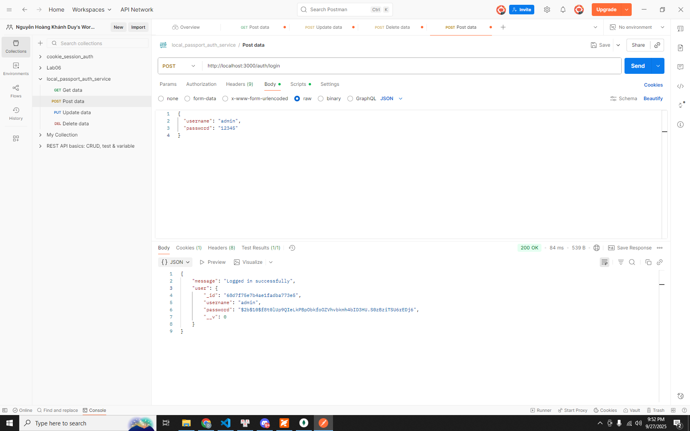
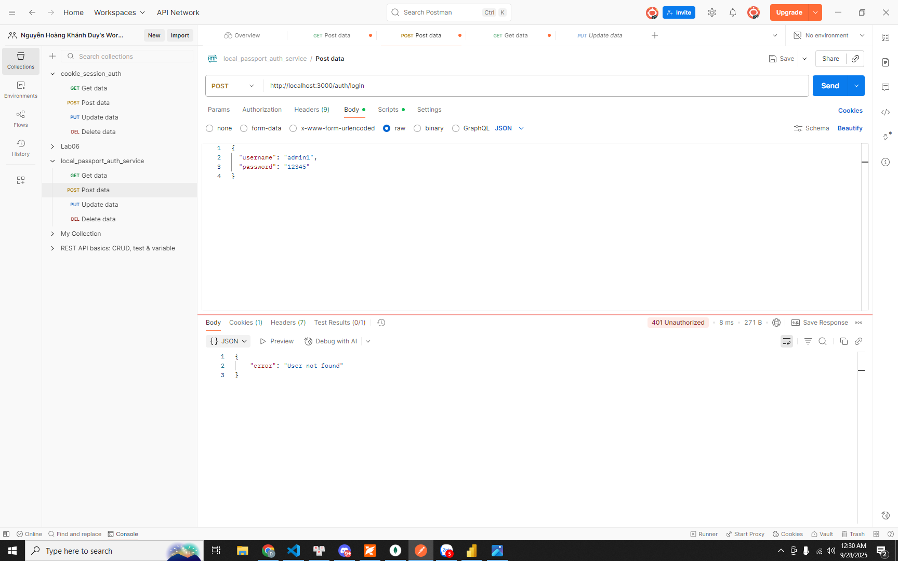
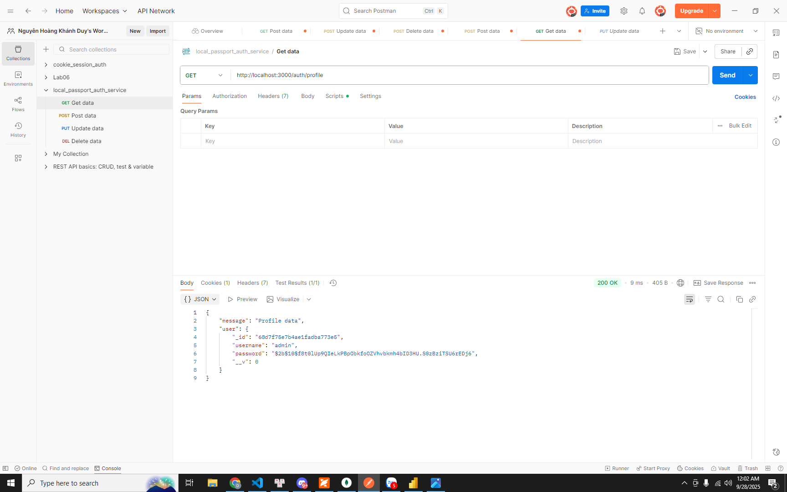
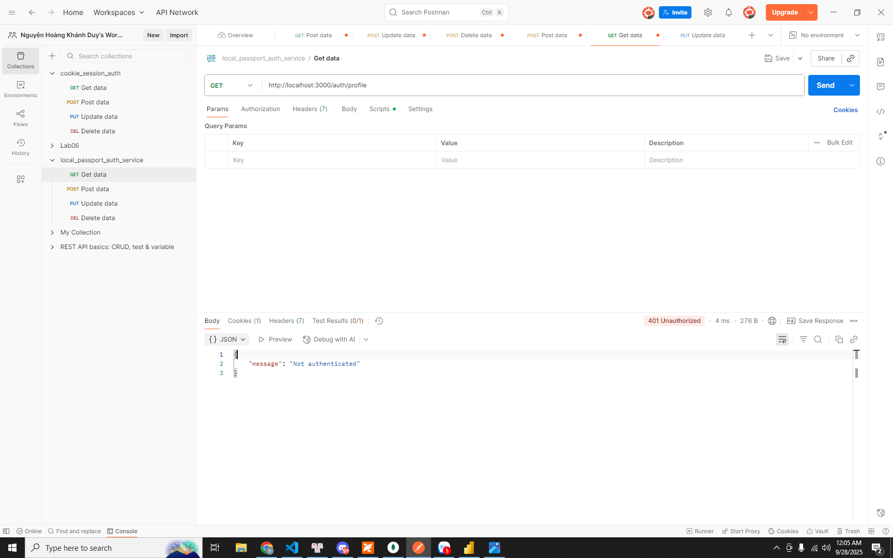
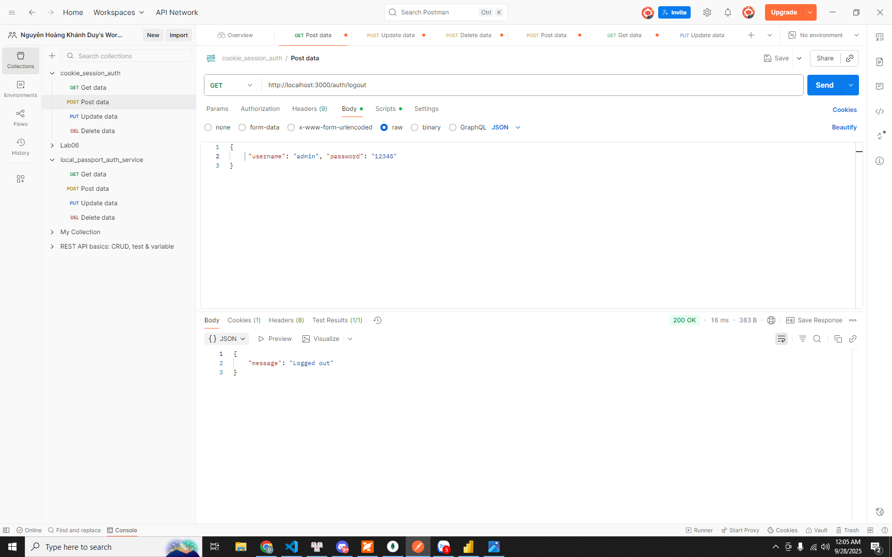

# Local Passport Auth Service

## Mô tả
Dự án này là một API xác thực người dùng sử dụng Node.js, Express, MongoDB, Passport.js và Passport-Local. Người dùng có thể đăng ký, đăng nhập, đăng xuất và truy cập thông tin cá nhân với bảo vệ phiên đăng nhập.

## Cài đặt
1. Clone dự án về máy.
2. Cài đặt các package:
   ```powershell
   npm install
   ```
3. Đảm bảo MongoDB đang chạy ở địa chỉ `mongodb://127.0.0.1:27017/passport_local_demo`.
4. Khởi động server:
   ```powershell
   node app.js
   ```

## Các chức năng API

### 1. Đăng ký tài khoản
- **Endpoint:** `POST /auth/register`
- **Body (JSON):**
  ```json
  {
    "username": "admin",
    "password": "12345"
  }
  ```
- **Kết quả thành công:**


  ```json
  { "message": "User registered successfully" }
  ```
- **Lỗi:**
  - Thiếu trường hoặc username đã tồn tại: `{ "error": "..." }` (HTTP 400)


### 2. Đăng nhập
- **Endpoint:** `POST /auth/login`
- **Body (JSON):**
  ```json
  {
    "username": "admin",
    "password": "12345"
  }
  ```
- **Kết quả thành công:**

  ```json
  { "message": "Logged in successfully", "user": { ... } }
  ```
- **Lỗi:**

  - Sai username: `{ "message": "User not found" }`
  
  - Sai password: `{ "message": "Wrong password" }`
  
  - HTTP 401 hoặc thông báo lỗi

### 3. Xem thông tin cá nhân
- **Endpoint:** `GET /auth/profile`
- **Yêu cầu:** Đã đăng nhập (gửi kèm cookie session)
- **Kết quả thành công:**

  ```json
  { "message": "Profile data", "user": { ... } }
  ```
- **Lỗi:**
  - Chưa đăng nhập: `{ "message": "Not authenticated" }` (HTTP 401)
  
### 4. Đăng xuất
- **Endpoint:** `GET /auth/logout`
- **Kết quả thành công:**

  ```json
  { "message": "Logged out" }
  ```

## Tác giả
- Tên: Nguyễn Hoàng Khánh Duy
